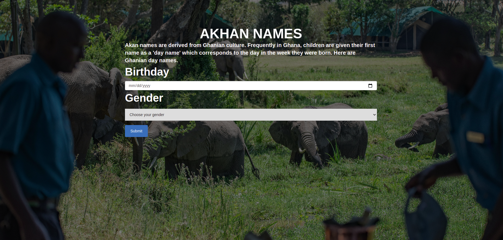

# Naming Day Ritual
This website is about  finding out the day an individual was born and return it together  with the name that the akan community give to their own children which normally corresponds to the day of birth.The html takes data in the input field and it gets manipulated by the javascript. Here is the [link](https://budds300.github.io/birthday-calendar/) to the website


## How to access it
It can be accessed by cloning the project from github.
You first  go to github and copy the [repository](https://github.com/budds300/birthday-calendar) and follow the steps below on your terminal
```
$  git clone<repo-link>
$  cd directory
$  code .
```
## How To Contribute
You can contribute by forking the project  and following the above steps to clone it
## Technologies Used
* HTML
* CSS
* JS
* Bootstrap
## Support and Contact
If you run into any problem in accessing or contributing or have a question about the project feel free to email me  budds300@gmail.com.

## License and Copyright
Licensed under [MIT license](LICENSE)